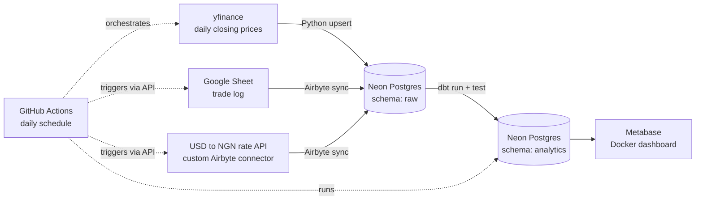

# PortfolioPulse

**Question answered:** *What is my investment portfolio actually worth, in both USD and Naira, over time?*

A daily data pipeline that tracks a 6-stock portfolio (AAPL, MSFT, NVDA, AMZN, META, GOOGL), values it in USD and NGN, and shows it on a Metabase dashboard.

## Architecture



| Layer | Tool | What it does |
|---|---|---|
| Prices | `scripts/load_stock_prices.py` (yfinance) | Downloads daily closes, upserts into `raw.stock_prices` (re-runs never duplicate) |
| Trades | Google Sheet + Airbyte | 20-trade log synced into `raw.trades` |
| Exchange rates | Custom Airbyte connector | Daily USD→NGN rates synced into `raw.api_usd_ngn_rates` (incremental) |
| Warehouse | Neon Postgres | `raw` (landing) and `analytics` (dbt output) schemas |
| Transform | dbt Core (`dbt/`) | 3 staging views + 2 mart tables + 27 tests |
| Dashboard | Metabase (Docker) | 4 charts on the `analytics` schema |
| Orchestration | GitHub Actions (`.github/workflows/daily_pipeline.yml`) | Weekdays 22:00 UTC: load prices → trigger both Airbyte syncs (`scripts/trigger_airbyte.py`) → `dbt run` → `dbt test`. Any failing step fails the run. |

## dbt models

- `stg_stock_prices`, `stg_trades`, `stg_exchange_rates` — clean and type the raw data (trades arrive as text).
- `mart_portfolio_value` — one row per ticker per day: shares held, average cost, market value and unrealized gain/loss in **USD and NGN**.
- `mart_portfolio_daily` — whole-portfolio totals per day, USD and NGN side by side.
- Tests: unique / not_null keys, accepted ticker values, never-null NGN rate, and a data-quality test that each logged trade price matches that day's market close.

See `docs/PORTFOLIOPULSE-EDDIE-NCUBE-ERD.pdf` for the table relationships.

## Design decisions

- **Upserts everywhere** so a re-run or a retry never creates duplicates.
- **Missing exchange-rate days are forward-filled** with the latest earlier rate, so the NGN value is never null.
- **NGN gain/loss = USD gain/loss × that day's rate** (valued at the day's exchange rate).
- **The originally planned rate API went offline** (HTTP 402), so a custom Airbyte connector was built on a free public currency API.
- Secrets live in `.env` locally and in GitHub Actions secrets in CI; nothing sensitive is committed.

## Run it yourself

```bash
pip install yfinance pandas psycopg2-binary python-dotenv requests dbt-postgres
# .env needs: NEON_DATABASE_URL, NEON_HOST, NEON_USER, NEON_PASSWORD, NEON_DB
python scripts/load_stock_prices.py
cd dbt && dbt run --profiles-dir . && dbt test --profiles-dir .
docker run -d -p 3000:3000 -v metabase-data:/metabase-data -e MB_DB_FILE=/metabase-data/metabase.db metabase/metabase
```

GitHub Actions secrets required: `NEON_DATABASE_URL`, `NEON_HOST`, `NEON_USER`, `NEON_PASSWORD`, `NEON_DB`, `AIRBYTE_CLIENT_ID`, `AIRBYTE_CLIENT_SECRET`, `AIRBYTE_CONNECTION_IDS`.

## Read-only database access

Reviewers can connect with the read-only `reviewer` role (credentials supplied in the submission email).
